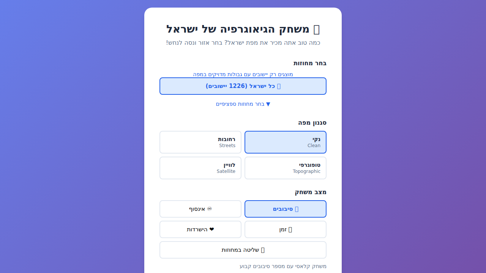

# 🗺️ משחק הגיאוגרפיה של ישראל — Israel Geo Game

An educational geography quiz game where players identify Israeli cities and settlements by clicking the correct settlement polygon on an interactive map of Israel.



## Features

- **Polygon-based gameplay** — Click the correct settlement shape directly on the map
- **Large national dataset** — `1,237` settlements in the data, with `1,226` currently playable using exact boundaries
- **District-based play** — Play all Israel or filter by specific districts
- **Five game modes** — Rounds, Endless, Time Attack, Survival, and Mastery
- **Attempt-based scoring** — First try is worth the most, then points decrease with each miss
- **Automatic reveal after 3 misses** — The correct settlement is revealed and the round scores `0` base points
- **Time bonus and streak bonus** — Time Attack rewards speed, and perfect streaks reward consistency
- **Round feedback and summary** — Review misses, per-round score, total score, bonuses, and best streak
- **Multiple map styles** — Clean, Streets, Topographic, and Satellite
- **Hebrew support** — Full RTL layout with Hebrew as the primary language, English secondary
- **Clean architecture** — Modular React + TypeScript code, easy to extend with new features

## Tech Stack

| Layer | Technology |
|-------|-----------|
| Framework | React 19 + TypeScript |
| Build tool | Vite |
| Map | Leaflet + React-Leaflet + public tile providers |
| Data | Static TypeScript modules with settlement metadata and boundary polygons |
| Styling | Plain CSS with CSS variables |

## Prerequisites

- **Node.js** ≥ 18
- **npm** ≥ 9

## Getting Started

```bash
# Clone the repository
git clone https://github.com/NaorTm/IsraelGeoGame.git
cd IsraelGeoGame

# Install dependencies
npm install

# Start the development server
npm run dev
```

Open [http://localhost:5173](http://localhost:5173) in your browser.

## Build for Production

```bash
npm run build    # TypeScript check + Vite production build
npm run preview  # Preview the production build locally
```

The output is placed in the `dist/` folder and can be deployed to any static hosting service.

## Deploy to GitHub Pages

This repository includes a GitHub Actions workflow that lints, builds, and deploys the app to GitHub Pages on every push to `main`.

To enable it:

1. Open the repository settings on GitHub.
2. Go to **Pages**.
3. Set **Source** to **GitHub Actions**.

After that, each push to `main` will publish the contents of `dist/`.

The site will be served from:

```text
https://naortm.github.io/IsraelGeoGame/
```

## Gameplay

Each round presents a settlement name and asks the player to click the correct settlement polygon on the map.

- A correct answer on the first click gives the maximum base score.
- Each wrong click reduces the base score.
- After `3` wrong clicks, the correct settlement is revealed automatically and the base score becomes `0`.
- In Time Attack mode, finishing faster adds a bonus.
- Perfect first-try streaks add an additional streak bonus.

### Game modes

- **Rounds** — Classic game with a fixed number of rounds (`5`, `10`, `15`, or `20`)
- **Endless** — Keep playing until you decide to stop
- **Time Attack** — Every round has a timer and awards a speed bonus
- **Survival** — The game ends after `3` total wrong guesses across the session
- **Mastery** — Finish one district at a time, then unlock the next district in sequence

## Project Structure

```
src/
├── components/          # React UI components
│   ├── GameMap.tsx      # Leaflet map with settlement polygons and click handling
│   ├── MenuScreen.tsx   # District, mode, round-count, timer, and map-style selection
│   ├── PlayingScreen.tsx# Active round state and answer handling
│   ├── FeedbackScreen.tsx# Post-round feedback and revealed answer state
│   └── SummaryScreen.tsx# End-of-game score and round summary table
├── data/
│   ├── settlements.ts    # Settlement dataset
│   ├── districts.ts      # District definitions and settlement-to-district mapping
│   ├── settlementBoundaries.ts # Combined boundary dataset metadata
│   └── boundaries/       # Split boundary chunks and boundary metadata
├── hooks/
│   └── useGame.ts       # Core game state machine
├── types/
│   └── index.ts         # TypeScript interfaces and types
├── utils/
│   ├── geo.ts           # Scoring, attempt formatting, and shuffle helpers
│   ├── districts.ts     # District lookup helpers
│   └── settlementBoundaries.ts # Boundary loading and fallback helpers
├── App.tsx              # Root component — phase router
├── App.css              # All application styles
├── index.css            # Global CSS reset
└── main.tsx             # Entry point
```

## Data Model

### Settlement

Each settlement entry in `src/data/settlements.ts`:

```typescript
{
  id: "jerusalem",
  name_he: "ירושלים",
  name_en: "Jerusalem",
  lat: 31.7683,
  lng: 35.2137,
  region: "jerusalem",
  type: "city",
  aliases: ["ירושלם"]
}
```

### District Mapping

District definitions are re-exported through `src/data/regions.ts`, and the primary district mapping lives in `src/data/districts.ts`.

Example district entry:

```typescript
{
  id: "גליל עליון",
  name_he: "גליל עליון",
  name_en: "גליל עליון",
  description_he: "מחוז פיקוד העורף גליל עליון",
  description_en: "Home Front Command district גליל עליון"
}
```

Playable settlement boundaries are loaded from the split files under `src/data/boundaries/`. A small fallback list in `src/data/boundaries/metadata.ts` marks settlements that currently only have approximate polygons; those are excluded from active play.

## How to Update Data

### Adding settlements

Edit `src/data/settlements.ts` and add entries to the `settlements` array. Every settlement should reference a valid base `region` id, and if you want district-based play to place it in a specific district, update the mapping in `src/data/districts.ts` as well.

To rebuild the settlements dataset from the official locality registries plus alias normalization, run:

```bash
npm run localities:build
```

### Rebuilding settlement polygons

When you want to refresh the polygon dataset, run:

```bash
npm run boundaries:build
```

The fetch step first tries Nominatim, then falls back to an exact-name Overpass query around the settlement centroid when global text geocoding returns the wrong place. This matters most for ambiguous names and settlements in Judea & Samaria, where plain geocoding often resolves to roads or streets instead of the settlement polygon.

For targeted retries, you can rebuild only a subset:

```bash
BOUNDARY_IDS=ariel,efrat,modiin_illit npm run boundaries:fetch
```

For large refreshes after expanding the locality list, use resumable chunks:

```bash
CHUNK_SIZE=20 MAX_BATCHES=5 npm run boundaries:batch
```

This will iterate over the current approximate-locality list, fetch boundaries in chunks, and re-split metadata after each chunk.

### Adding or changing districts

Edit `src/data/districts.ts`. The game UI automatically picks up new district definitions and settlement mappings.

## Scoring

### Base score by wrong clicks

| Wrong clicks before success | Base score |
|----------------------------|------------|
| 0 | 3 |
| 1 | 2 |
| 2 | 1 |
| 3+ | 0 |

After the third wrong click, the round is submitted automatically and the correct settlement is revealed.

### Time Attack bonus

| Remaining time ratio | Bonus |
|----------------------|-------|
| `>= 66%` | 3 |
| `>= 33%` | 2 |
| `> 0%` | 1 |
| `0%` | 0 |

### Streak bonus

- Perfect first-try streaks start giving bonus points from the second consecutive perfect round.
- The streak bonus grows by `+1` per qualifying round and is capped at `+3`.

## Future Expansion Ideas

The architecture is designed for easy extension:

- 🏆 Leaderboard (localStorage or backend)
- 🔍 Search & learn mode — explore settlements on the map
- 🎚️ Difficulty levels
- 🗂️ Category filters (only cities, only kibbutzim, etc.)
- 🗺️ Map overlays (region boundaries, terrain)
- 🌐 Full i18n support

## License

This project is provided as-is for educational purposes.
